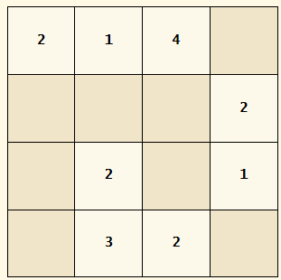
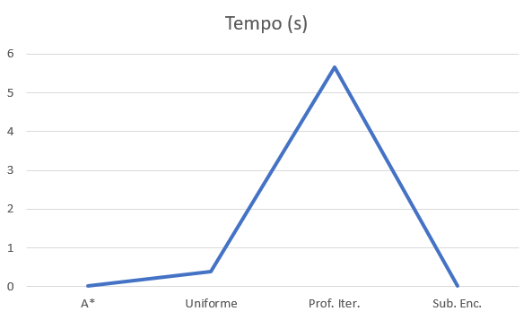

# Especificação da Versão do Sudoku com Subgrades



O Sudoku é um jogo baseado na colocação lógica de números inteiros em uma grade M x M. O objetivo do jogo é a colocação de números de 1 a M em cada célula da grade M x M, de forma que em todas as colunas e linhas da grade não ocorra a repetição de nenhum número.

Na versão mais complexa do Sudoku, a grade deve ser do tipo M² x M² (N = M², para N e M inteiros), de forma que a grade principal pode ser dividida em subgrades menores de tamanho M x M. Assim, o objetivo do jogo é a colocação de números de 1 a N em cada célula da grade M² x M², de forma que em todas as colunas e linhas da grade não ocorra a repetição de nenhum número e também com a restrição adicional de não haver repetição dos números de 1 a N nas subgrades M x M. O quebra-cabeça possui algumas pistas iniciais, que são números inseridos em algumas células e cabe ao desafiante descobrir que valores colocar no restante das células vazias de forma a atender as restrições do puzzle.

Por exemplo, uma possível configuração inicial do puzzle 9x9, com subgrades 3x3 (N=9 e M=3) é vista na Figura a, contemplando as dicas iniciais, enquanto a Figura b apresenta uma solução final para essa instância, onde é possível verificar que não existem repetições nas 9 linhas, nas 9 colunas e também nas 9 subgrades 3x3.

## Testes em relação as Heurísticas:

## Heurísticas Testadas:

### (1) -

```
def calculaHeuristica(self):
      h = 0
      n = len(self.Dados)
    
      for i in range(n):
          linha_vazias = self.Dados[i].count(0)
          coluna_vazias = sum(1 for j in range(n) if self.Dados[j][i] == 0)
        
          m = int(math.sqrt(n))
          subgrade_linha = (i // m) * m
          subgrade_coluna = (i % m) * m
          subgrade_vazias = sum(1 for l in range(subgrade_linha, subgrade_linha + m) for c in range(subgrade_coluna, subgrade_coluna + m) if self.Dados[l][c] == 0)
        
          # Adiciona o num de conj vazios para essa linha, coluna e subgrade
          h += linha_vazias + coluna_vazias + subgrade_vazias
    
      return h
```

#### Médio = Células preenchidas = 7/8

    # [2, 1, 4, 0],
    # [0, 0, 0, 2],
    # [0, 2, 0, 1],
    # [0, 3, 2, 0]

#### Resultado:

```
Número de nós visitados: 44
Profundidade: 8
Custo Total: 8
```

#### Médio 2:

```
    [0, 0, 0, 0],
    [1, 0, 3, 0],
    [4, 3, 1, 0],
    [2, 0, 0, 0]

```

#### Resultado:

```
Número de nós visitados: 189
Profundidade: 10
Custo Total: 10
```

#### Difícil = Células preenchidas = 4

    [0,0,0,3],
    [0,4,0,0],
    [0,0,3,2],
    [0,0,0,0]

#### Resultado:

```
Número de nós visitados: 1611
Profundidade: 12
Custo Total: 12
```

### (2) -

```
  def calculaHeuristica(self):
    h = 0
    n = len(self.Dados)
    for i in range(n):
      for j in range(n):
        if self.Dados[i][j] == 0:
          h +=4
    return h
```

# Médio = Células preenchidas = 7/8

    # [2, 1, 4, 0],
    # [0, 0, 0, 2],
    # [0, 2, 0, 1],
    # [0, 3, 2, 0]

#### Resultado:

```
Número de nós visitados: 44
Profundidade: 8
Custo Total: 8
```

#### Médio 2:

    [0, 0, 0, 0],
    [1, 0, 3, 0],
    [4, 3, 1, 0],
    [2, 0, 0, 0]

#### Resultado:

```
Número de nós visitados: 189
Profundidade: 10
Custo Total: 10
```

#### Difícil = Células preenchidas = 4

    [0,0,0,3],
    [0,4,0,0],
    [0,0,3,2],
    [0,0,0,0]

#### Resultado:

```
Número de nós visitados: 1611
Profundidade: 12
Custo Total: 12
```
      



## Escalonamento de Tarefas

#### Busca A*

```
Solução:
[[], []]
-----------------------------------------------------
[[[0, 0, 8]], []]
-----------------------------------------------------
[[[0, 0, 8], [1, 8, 11]], []]
-----------------------------------------------------
[[[0, 0, 8], [1, 8, 11], [3, 11, 15]], []]
-----------------------------------------------------
[[[0, 0, 8], [1, 8, 11], [3, 11, 15]], [[2, 8, 14]]]
-----------------------------------------------------
[[[0, 0, 8], [1, 8, 11], [3, 11, 15], [7, 15, 18]], [[2, 8, 14]]]
-----------------------------------------------------
[[[0, 0, 8], [1, 8, 11], [3, 11, 15], [7, 15, 18], [5, 18, 22]], [[2, 8, 14]]]
-----------------------------------------------------
[[[0, 0, 8], [1, 8, 11], [3, 11, 15], [7, 15, 18], [5, 18, 22]], [[2, 8, 14], [6, 14, 20]]]
-----------------------------------------------------
[[[0, 0, 8], [1, 8, 11], [3, 11, 15], [7, 15, 18], [5, 18, 22]], [[2, 8, 14], [6, 14, 20], [10, 20, 22]]]
-----------------------------------------------------
[[[0, 0, 8], [1, 8, 11], [3, 11, 15], [7, 15, 18], [5, 18, 22]], [[2, 8, 14], [6, 14, 20], [10, 20, 22], [4, 22, 24]]]
-----------------------------------------------------
[[[0, 0, 8], [1, 8, 11], [3, 11, 15], [7, 15, 18], [5, 18, 22], [9, 22, 25]], [[2, 8, 14], [6, 14, 20], [10, 20, 22], [4, 22, 24]]]
-----------------------------------------------------
[[[0, 0, 8], [1, 8, 11], [3, 11, 15], [7, 15, 18], [5, 18, 22], [9, 22, 25]], [[2, 8, 14], [6, 14, 20], [10, 20, 22], [4, 22, 24], [8, 24, 28]]]
-----------------------------------------------------

Número de nós visitados: 145727
Profundidade: 11
Custo Total: 28
Tempo gasto: 5725.3901126384735 segundos
```

#### Busca Gulosa

```
python .\Buscas.py
Solução: 
[{'id': 1, 'tempo': 10, 'processador': None, 'dependencias': []}, {'id': 2, 'tempo': 15, 'processador': None, 'dependencias': []}, {'id': 3, 'tempo': 20, 'processador': None, 'dependencias': []}, {'id': 4, 'tempo': 30, 'processador': None, 'dependencias': []}, {'id': 5, 'tempo': 40, 'processador': None, 'dependencias': []}, {'id': 6, 'tempo': 50, 'processador': None, 'dependencias': []}, {'id': 7, 'tempo': 60, 'processador': None, 'dependencias': []}, {'id': 8, 'tempo': 70, 'processador': None, 'dependencias': []}, {'id': 9, 'tempo': 80, 'processador': None, 'dependencias': []}, {'id': 10, 'tempo': 90, 'processador': None, 'dependencias': [5, 6]}]
[{'id': 1, 'tempo': 10, 'processador': 0, 'dependencias': []}, {'id': 2, 'tempo': 15, 'processador': None, 'dependencias': []}, {'id': 3, 'tempo': 20, 'processador': None, 'dependencias': []}, {'id': 4, 'tempo': 30, 'processador': None, 'dependencias': []}, {'id': 5, 'tempo': 40, 'processador': None, 'dependencias': []}, {'id': 6, 'tempo': 50, 'processador': None, 'dependencias': []}, {'id': 7, 'tempo': 60, 'processador': None, 'dependencias': []}, {'id': 8, 'tempo': 70, 'processador': None, 'dependencias': []}, {'id': 9, 'tempo': 80, 'processador': None, 'dependencias': []}, {'id': 10, 'tempo': 90, 'processador': None, 'dependencias': [5, 6]}]
[{'id': 1, 'tempo': 10, 'processador': 0, 'dependencias': []}, {'id': 2, 'tempo': 15, 'processador': 0, 'dependencias': []}, {'id': 3, 'tempo': 20, 'processador': None, 'dependencias': []}, {'id': 4, 'tempo': 30, 'processador': None, 'dependencias': []}, {'id': 5, 'tempo': 40, 'processador': None, 'dependencias': []}, {'id': 6, 'tempo': 50, 'processador': None, 'dependencias': []}, {'id': 7, 'tempo': 60, 'processador': None, 'dependencias': []}, {'id': 8, 'tempo': 70, 'processador': None, 'dependencias': []}, {'id': 9, 'tempo': 80, 'processador': None, 'dependencias': []}, {'id': 10, 'tempo': 90, 'processador': None, 'dependencias': [5, 6]}]
[{'id': 1, 'tempo': 10, 'processador': 0, 'dependencias': []}, {'id': 2, 'tempo': 15, 'processador': 0, 'dependencias': []}, {'id': 3, 'tempo': 20, 'processador': 0, 'dependencias': []}, {'id': 4, 'tempo': 30, 'processador': None, 'dependencias': []}, {'id': 5, 'tempo': 40, 'processador': None, 'dependencias': []}, {'id': 6, 'tempo': 50, 'processador': None, 'dependencias': []}, {'id': 7, 'tempo': 60, 'processador': None, 'dependencias': []}, {'id': 8, 'tempo': 70, 'processador': None, 'dependencias': []}, {'id': 9, 'tempo': 80, 'processador': None, 'dependencias': []}, {'id': 10, 'tempo': 90, 'processador': None, 'dependencias': [5, 6]}]
[{'id': 1, 'tempo': 10, 'processador': 0, 'dependencias': []}, {'id': 2, 'tempo': 15, 'processador': 0, 'dependencias': []}, {'id': 3, 'tempo': 20, 'processador': 0, 'dependencias': []}, {'id': 4, 'tempo': 30, 'processador': 0, 'dependencias': []}, {'id': 5, 'tempo': 40, 'processador': None, 'dependencias': []}, {'id': 6, 'tempo': 50, 'processador': None, 'dependencias': []}, {'id': 7, 'tempo': 60, 'processador': None, 'dependencias': []}, {'id': 8, 'tempo': 70, 'processador': None, 'dependencias': []}, {'id': 9, 'tempo': 80, 'processador': None, 'dependencias': []}, {'id': 10, 'tempo': 90, 'processador': None, 'dependencias': [5, 6]}]
[{'id': 1, 'tempo': 10, 'processador': 0, 'dependencias': []}, {'id': 2, 'tempo': 15, 'processador': 0, 'dependencias': []}, {'id': 3, 'tempo': 20, 'processador': 0, 'dependencias': []}, {'id': 4, 'tempo': 30, 'processador': 0, 'dependencias': []}, {'id': 5, 'tempo': 40, 'processador': 0, 'dependencias': []}, {'id': 6, 'tempo': 50, 'processador': None, 'dependencias': []}, {'id': 7, 'tempo': 60, 'processador': None, 'dependencias': []}, {'id': 8, 'tempo': 70, 'processador': None, 'dependencias': []}, {'id': 9, 'tempo': 80, 'processador': None, 'dependencias': []}, {'id': 10, 'tempo': 90, 'processador': None, 'dependencias': [5, 6]}]
[{'id': 1, 'tempo': 10, 'processador': 0, 'dependencias': []}, {'id': 2, 'tempo': 15, 'processador': 0, 'dependencias': []}, {'id': 3, 'tempo': 20, 'processador': 0, 'dependencias': []}, {'id': 4, 'tempo': 30, 'processador': 0, 'dependencias': []}, {'id': 5, 'tempo': 40, 'processador': 0, 'dependencias': []}, {'id': 6, 'tempo': 50, 'processador': 0, 'dependencias': []}, {'id': 7, 'tempo': 60, 'processador': None, 'dependencias': []}, {'id': 8, 'tempo': 70, 'processador': None, 'dependencias': []}, {'id': 9, 'tempo': 80, 'processador': None, 'dependencias': []}, {'id': 10, 'tempo': 90, 'processador': None, 'dependencias': [5, 6]}]
[{'id': 1, 'tempo': 10, 'processador': 0, 'dependencias': []}, {'id': 2, 'tempo': 15, 'processador': 0, 'dependencias': []}, {'id': 3, 'tempo': 20, 'processador': 0, 'dependencias': []}, {'id': 4, 'tempo': 30, 'processador': 0, 'dependencias': []}, {'id': 5, 'tempo': 40, 'processador': 0, 'dependencias': []}, {'id': 6, 'tempo': 50, 'processador': 0, 'dependencias': []}, {'id': 7, 'tempo': 60, 'processador': 0, 'dependencias': []}, {'id': 8, 'tempo': 70, 'processador': None, 'dependencias': []}, {'id': 9, 'tempo': 80, 'processador': None, 'dependencias': []}, {'id': 10, 'tempo': 90, 'processador': None, 'dependencias': [5, 6]}]
[{'id': 1, 'tempo': 10, 'processador': 0, 'dependencias': []}, {'id': 2, 'tempo': 15, 'processador': 0, 'dependencias': []}, {'id': 3, 'tempo': 20, 'processador': 0, 'dependencias': []}, {'id': 4, 'tempo': 30, 'processador': 0, 'dependencias': []}, {'id': 5, 'tempo': 40, 'processador': 0, 'dependencias': []}, {'id': 6, 'tempo': 50, 'processador': 0, 'dependencias': []}, {'id': 7, 'tempo': 60, 'processador': 0, 'dependencias': []}, {'id': 8, 'tempo': 70, 'processador': 0, 'dependencias': []}, {'id': 9, 'tempo': 80, 'processador': None, 'dependencias': []}, {'id': 10, 'tempo': 90, 'processador': None, 'dependencias': [5, 6]}]
[{'id': 1, 'tempo': 10, 'processador': 0, 'dependencias': []}, {'id': 2, 'tempo': 15, 'processador': 0, 'dependencias': []}, {'id': 3, 'tempo': 20, 'processador': 0, 'dependencias': []}, {'id': 4, 'tempo': 30, 'processador': 0, 'dependencias': []}, {'id': 5, 'tempo': 40, 'processador': 0, 'dependencias': []}, {'id': 6, 'tempo': 50, 'processador': 0, 'dependencias': []}, {'id': 7, 'tempo': 60, 'processador': 0, 'dependencias': []}, {'id': 8, 'tempo': 70, 'processador': 0, 'dependencias': []}, {'id': 9, 'tempo': 80, 'processador': 0, 'dependencias': []}, {'id': 10, 'tempo': 90, 'processador': None, 'dependencias': [5, 6]}]

Número de nós visitados: 111
Profundidade: 9
Custo Total: 955
```
